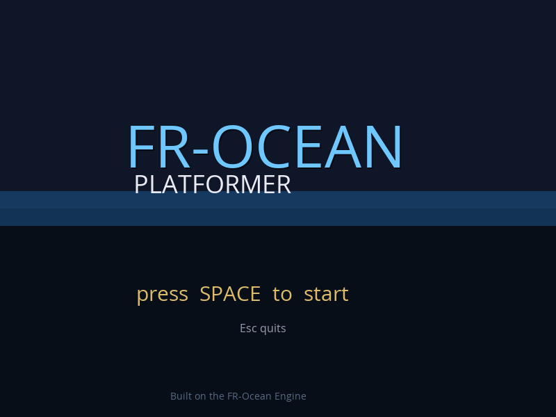
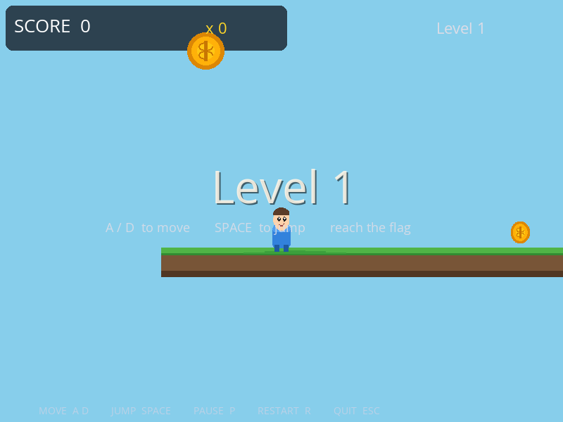
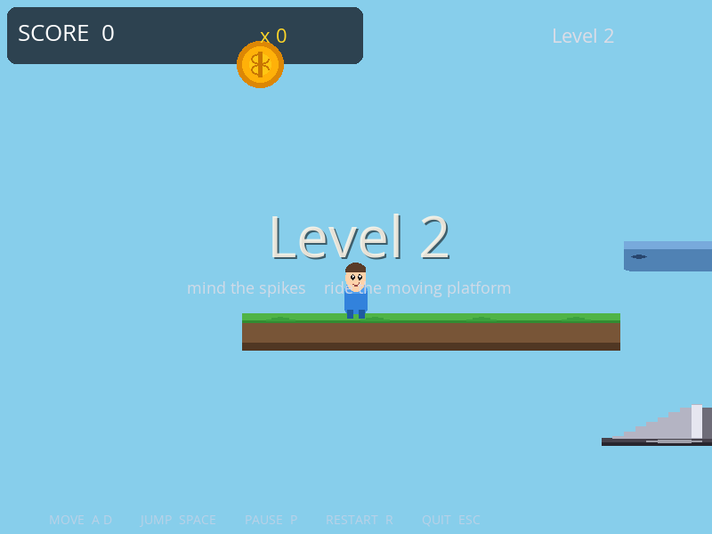
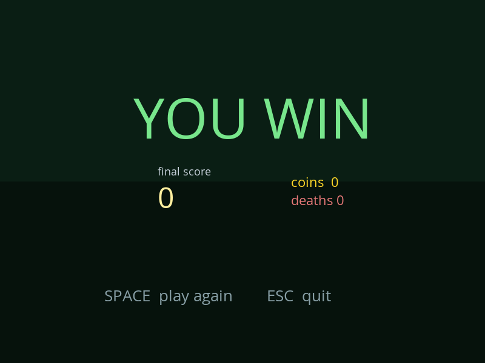
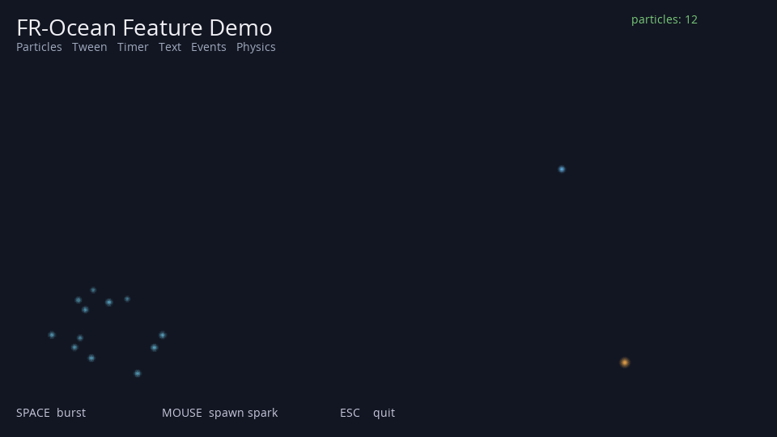

# FR-Ocean Engine

A minimal, focused 2D game engine. C++17 core, Lua 5.4 for game logic, SDL2 for rendering, Box2D for physics. Cross-platform via CMake, no external toolchain, no editor — you write components in Lua and ship.


<p align="center">
  
</p>

<p align="center">
  <em>Actual screenshots, nothing touched up. Everything you see is produced by the engine under <code>./build/bin/game_engine</code>.</em>
</p>

---

## Quickstart

```bash
git clone https://github.com/jack-chaudier/fr-ocean-engine.git
cd fr-ocean-engine
make play          # configure, build, launch the platformer
```

That's it. Prerequisites: a C++17 compiler and CMake ≥ 3.16. SDL2 is vendored on macOS and Windows; Linux uses system packages (`libsdl2-dev libsdl2-image-dev libsdl2-mixer-dev libsdl2-ttf-dev`). Sprite PNGs are committed, so no Python needed to run the samples.

No `make`? The raw commands are:

```bash
cmake --preset release
cmake --build --preset release
./build/bin/game_engine --resources resources.platformer/
```

---

## Gameplay

<table>
<tr>
<td width="50%"><a href="docs/screenshots/level1.png"></a></td>
<td width="50%"><a href="docs/screenshots/level2.png"></a></td>
</tr>
<tr>
<td><b>Level 1 — tutorial.</b> Long ground, three coins, one stompable enemy, a two-step stair to a higher coin, flag on the right.</td>
<td><b>Level 2 — challenge.</b> Start pad → mid-pad jump → two staggered moving platforms over a spike floor → end pad with an enemy, coin and flag.</td>
</tr>
<tr>
<td width="50%"><a href="docs/screenshots/victory.png"></a></td>
<td width="50%"><a href="docs/screenshots/demo.png"></a></td>
</tr>
<tr>
<td><b>Victory.</b> Score, coin count, death count all persist across levels via <code>Scene.DontDestroy</code>.</td>
<td><b>Feature demo.</b> ~80 lines of Lua exercising every engine subsystem: particles, tweens, timers, events, physics, input, text.</td>
</tr>
</table>

| Sample | Run | Shows |
|---|---|---|
| Platformer | `make play` | Full gameplay loop: title → level1 → level2 → victory. Variable jump, coyote time, stomp enemies, coin pickups, screen shake, fade-to-black transitions, persistent score. |
| Feature demo | `make demo` | Minimal showcase: particle bursts, scheduled timers, tweens, events, a bouncing physics ball, input-reactive particles. |

### Controls (platformer)

| Key | Action |
|---|---|
| `A` / `←` / `D` / `→` | Move |
| `Space` / `W` / `↑` | Jump (hold for higher, ~100 ms coyote time and jump buffering) |
| `P` | Pause (toggles `Time.SetTimeScale`) |
| `R` | Restart the current level |
| `F1` | Toggle Box2D collider debug overlay |
| `Esc` | Quit |

---

## Architecture

<p align="center">
  
</p>

### Per-frame pipeline

<p align="center">
  
</p>

Every frame: input events → time tick → schedulers (tween, timer, animation, particles, camera) → scene lifecycle (`OnStart` → `OnUpdate` → physics step → `OnLateUpdate` → queued destroys) → render (clear → world sprites → particles → UI rects → text → debug pixels → present).

See [ARCHITECTURE.md](ARCHITECTURE.md) for the subsystem walk-through and [API_REFERENCE.md](API_REFERENCE.md) for every Lua binding.

---

## Writing a component

Every game object is an actor with components. A component is a Lua table that defines lifecycle methods. The coin, for example:

```lua
-- resources.platformer/component_types/Coin.lua
Coin = { value = 10, collected = false, bob = 0 }

function Coin:OnStart()
    self.rb = self.actor:GetComponent("Rigidbody")
end

function Coin:OnUpdate()
    self.bob = self.bob + Time.GetDeltaTime() * 3
    local p = self.rb:GetPosition()
    Image.DrawEx("coin", p.x, p.y + math.sin(self.bob) * 0.12,
                 0, 0.7, 0.7, 0.5, 0.5, 255, 215, 40, 255, 2)
end

function Coin:Collect()
    if self.collected then return end
    self.collected = true
    Event.Emit("coin_collected", { value = self.value })
    Actor.Destroy(self.actor)
end
```

Then reference it from the scene JSON or actor template:

```json
{ "name": "Coin", "template": "coin",
  "components": { "Rigidbody": { "x": -3, "y": 2.4 } } }
```

## Lua API surface

| Namespace | What it lets you do |
|---|---|
| `Actor` | `Find`, `FindAll`, `Instantiate`, `Destroy` |
| `Input` | `GetKey*`, `GetMouse*`, `GetMouseScrollDelta`, `HideCursor`, `ShowCursor` |
| `Image` | `Draw`, `DrawEx`, `DrawUI`, `DrawUIEx`, `DrawPixel`, `DrawRect` |
| `Text` | `Draw(str, x, y, font, size, r, g, b, a)` |
| `Audio` | `Play`, `Halt`, `SetVolume` |
| `Camera` | `SetPosition`, `SetZoom`, `Follow`, `Shake`, `SetBounds` |
| `Scene` | `Load`, `LoadWithTransition("scene", "fade", dur)`, `GetCurrent`, `DontDestroy` |
| `Physics` | `Raycast`, `RaycastAll` |
| `Event` | `Subscribe`, `SubscribeOnce`, `Emit`, `Unsubscribe`, `UnsubscribeAll` |
| `Timer` | `After(dt, fn)`, `Every(delay, interval, fn)`, `Cancel`, `CancelAll` |
| `Tween` | `To(obj, field, target, duration)`, `Cancel`, `CancelAll` |
| `Particles` | `Emit(x, y, count, ParticleConfig)`, `GetActiveCount` |
| `Animation` | `Define`, `Play`, `Stop`, `SetFrame`, `IsPlaying` |
| `Time` | `GetDeltaTime`, `GetUnscaledDeltaTime`, `GetTotalTime`, `SetTimeScale`, `GetFrameCount` |
| `Application` | `Quit`, `Sleep`, `OpenURL`, `GetFrame` |

---

## Build

```bash
# macOS, Linux
cmake --preset release
cmake --build --preset release

# Windows (Visual Studio)
cmake --preset release -G "Visual Studio 17 2022"
cmake --build --preset release
```

The binary is `build/bin/game_engine`. Resources are copied to `build/bin/resources/`.

### Regenerating sprites

All sample sprites are tracked, so a fresh clone runs out of the box. If you want to change them, edit `resources.<game>/create_assets.py` and rerun:

```bash
make assets
```

(Needs [`uv`](https://github.com/astral-sh/uv) or `pip install Pillow`.)

## Testing

```bash
make test
```

Two CTest targets boot each sample for 60 headless frames with `--self-check` and fail on any `[FATAL]` or `[ERROR]` log line. Good CI shape.

## CLI flags

```
--resources <path>     Override the resources directory
--scene <name>         Start in this scene instead of game.config's initial_scene
--self-check [N]       Run N frames (default 60) then exit 0
--screenshot <path>    Save the final frame as a PNG (implies --self-check)
--debug                Enable DEBUG-level logs
--version, --help
```

`--screenshot` is how `docs/screenshots/*.png` are produced — see the `screenshots` target in the Makefile.

## Project layout

```
game_engine/            C++17 core (~7k LOC, 53 files)
resources.platformer/   Hero sample game — two-level platformer
resources.demo/         Minimal feature showcase
vendor/                 SDL2, Box2D, Lua 5.4, LuaBridge, GLM, rapidjson
scripts/run_game.py     Alt build + launch helper
docs/                   Architecture SVGs · gameplay screenshots
```

## Docs

- [ARCHITECTURE.md](ARCHITECTURE.md) — subsystem walk-through, shutdown-order contract, how to extend
- [API_REFERENCE.md](API_REFERENCE.md) — every Lua binding, with examples
- [CODE_STANDARDS.md](CODE_STANDARDS.md) — C++ conventions
- [CONTRIBUTING.md](CONTRIBUTING.md) — setup and PR workflow
- [CHANGELOG.md](CHANGELOG.md) — release notes

## License

MIT. See [LICENSE](LICENSE).
