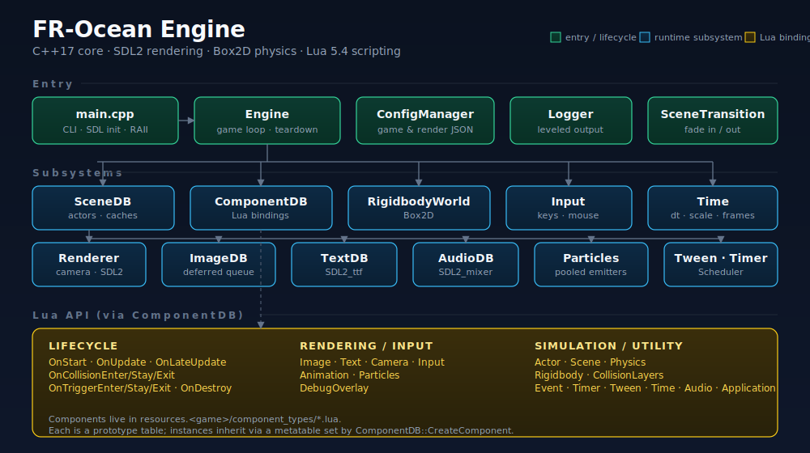
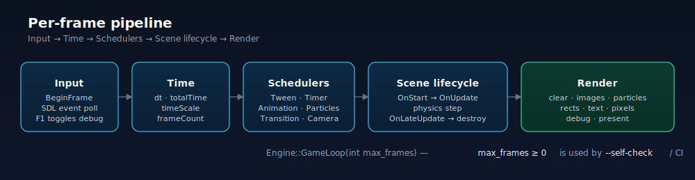

# FR-Ocean Engine

A minimal, focused 2D game engine. C++17 core, Lua for game logic, SDL2 for rendering, Box2D for physics. Cross-platform via CMake. No frameworks, no editor — you write components in Lua and ship.

<p align="center">
  
</p>

## Quickstart

```bash
git clone https://github.com/<you>/fr-ocean-engine.git
cd fr-ocean-engine
cmake --preset release
cmake --build --preset release
./build/bin/game_engine --resources resources.platformer/
```

That's it. Prerequisites: a C++17 compiler, CMake ≥ 3.16. SDL2 is vendored on macOS and Windows; Linux uses system packages (`libsdl2-dev libsdl2-image-dev libsdl2-mixer-dev libsdl2-ttf-dev`).

## What's in the box

| Sample | Resources dir | What it shows |
|---|---|---|
| **Platformer** | `resources.platformer/` | Full gameplay loop: movement, variable jump, coyote time, coins, stompable enemies, spikes, moving platforms, a flag that transitions between two levels, persistent score, camera follow + shake |
| **Feature demo** | `resources.demo/` | ~80 lines of Lua hitting every engine subsystem: particles, tweens, timers, events, physics, input, text |

Run either:

```bash
python3 scripts/run_game.py platformer   # default
python3 scripts/run_game.py demo
```

## Writing a component

Every game object is an actor with components. A component is a Lua table that defines lifecycle methods.

```lua
-- resources.platformer/component_types/Coin.lua
Coin = { value = 10, collected = false, bob = 0 }

function Coin:OnStart()
    self.rigidbody = self.actor:GetComponent("Rigidbody")
end

function Coin:OnUpdate()
    self.bob = self.bob + Time.GetDeltaTime() * 3
    local p = self.rigidbody:GetPosition()
    Image.DrawEx("coin", p.x, p.y + math.sin(self.bob) * 0.1,
                 0, 0.3, 0.3, 0.5, 0.5, 255, 215, 40, 255, 2)
end

function Coin:Collect()
    if self.collected then return end
    self.collected = true
    Event.Emit("coin_collected", { value = self.value })
    Actor.Destroy(self.actor)
end
```

## Frame pipeline

<p align="center">
  
</p>

Every frame: `Input → Time → scene lifecycle (OnStart / OnUpdate / physics / OnLateUpdate) → schedulers → render`.

## Lua API surface

| Namespace | What it lets you do |
|---|---|
| `Actor` | `Find`, `FindAll`, `Instantiate`, `Destroy` |
| `Input` | `GetKey(Down\|Up)`, `GetMousePosition`, `GetMouseButton*`, `GetMouseScrollDelta` |
| `Image` | `Draw`, `DrawEx`, `DrawUI`, `DrawUIEx`, `DrawPixel`, `DrawRect` |
| `Text` | `Draw(str, x, y, font, size, r, g, b, a)` |
| `Audio` | `Play`, `Halt`, `SetVolume` |
| `Camera` | `SetPosition`, `SetZoom`, `Follow`, `Shake`, `SetBounds` |
| `Scene` | `Load`, `LoadWithTransition(name, "fade", dur)`, `GetCurrent`, `DontDestroy` |
| `Physics` | `Raycast`, `RaycastAll` |
| `Event` | `Subscribe`, `SubscribeOnce`, `Emit`, `Unsubscribe`, `UnsubscribeAll` |
| `Timer` | `After(dt, fn)`, `Every(delay, interval, fn)`, `Cancel`, `CancelAll` |
| `Tween` | `To(obj, field, target, duration)`, `Cancel`, `CancelAll` |
| `Particles` | `Emit(x, y, count, ParticleConfig)`, `GetActiveCount` |
| `Animation` | `Define`, `Play`, `Stop`, `SetFrame`, `IsPlaying` |
| `Time` | `GetDeltaTime`, `GetTotalTime`, `SetTimeScale`, `GetFrameCount` |
| `Application` | `Quit`, `Sleep`, `OpenURL`, `GetFrame` |

Full reference in [API_REFERENCE.md](API_REFERENCE.md).

## Project layout

```
game_engine/            C++17 core (~7k LOC, 28 files)
resources.platformer/   Hero sample game
resources.demo/         Minimal feature-demo scene
vendor/                 SDL2, Box2D, Lua 5.4, LuaBridge, GLM, rapidjson
scripts/run_game.py     Build + launch helper
docs/                   SVG diagrams for README
```

## Building

```bash
# macOS / Linux
cmake --preset release
cmake --build --preset release

# Windows
cmake --preset release -G "Visual Studio 17 2022"
cmake --build --preset release
```

The executable is `build/bin/game_engine`. Sample resources are copied into `build/bin/resources/`.

First time running the samples, regenerate art:

```bash
uv run --with Pillow python3 resources.platformer/create_assets.py
uv run --with Pillow python3 resources.demo/create_assets.py
```

## Testing

CTest runs a headless smoke boot of each sample:

```bash
cd build && ctest --output-on-failure
```

Both tests run the engine for 60 frames with `--self-check`, asserting no FATAL/ERROR logs and a clean shutdown. Useful in CI.

## Controls (platformer)

| Input | Action |
|---|---|
| `A` / `←` / `D` / `→` | Move |
| `Space` / `W` / `↑` | Jump (hold for higher jump, coyote time) |
| `P` | Pause (toggles `Time.SetTimeScale`) |
| `R` | Restart level |
| `F1` | Toggle physics debug draw |
| `Esc` | Quit |

## Docs

- [ARCHITECTURE.md](ARCHITECTURE.md) — subsystem walk-through
- [API_REFERENCE.md](API_REFERENCE.md) — full Lua API
- [CODE_STANDARDS.md](CODE_STANDARDS.md) — C++ conventions
- [CONTRIBUTING.md](CONTRIBUTING.md) — PR workflow
- [CHANGELOG.md](CHANGELOG.md) — release notes

## License

MIT. See [LICENSE](LICENSE).
